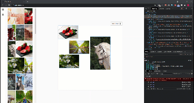

# React + IPFS

> A quick example created by Tan Nguyen. In this demo, you will see how to using React as FE and express api + IPFS as BE

## Creator

[Tan Nguyen](https://github.com/tannguyen248)

## Table of Contents

- [Concept](#concept)
- [POC](#poc)
- [Install](#install)
  - [Install project packages](#install-project-packages)
  - [Install client](#install-client)
  - [Install server](#install-server)
    - [Install ipfs](#install-ipfs)
    - [Install express](#install-express)
- [Run](#run)

## Concept

You can using IPFS directly on FE, but I don't think it's a good idea. With IPFS + Express API, you can easily address future problems that you might be facing with IPFS. In my view, IPFS is the future and it can combine with API to become a new development stack

## POC



## Install

### Install project packages

```bash
yarn
```

### Install client

```bash
yarn run install-client
```

### Install server

#### Instal IPFS

Follow this link: https://docs.ipfs.io/install/command-line#official-distributions

#### Install express

```sh
yarn run install-server
```

## Run

```sh
yarn run dev
```

Go to: http://localhost:3000/
